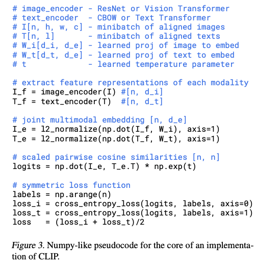

# Zero-Shot Prediction using the CLIP architecture

### Through this experiment, I have carried out zero-shot predictions using the CLIP ( Contrastive language-image pre-training ) architecture. 

> Given a batch of N (image, text) pairs, CLIP is trained to predict which of the N×N possible (image, text) pairings across a batch actually occurred. To do this, CLIP learns a multi-modal embedding space by jointly training an image encoder and text encoder to maximize the cosine similarity of the image and text embeddings of the N real pairs in the batch while minimizing the cosine similarity of the embeddings of the N2−N incorrect pairings. We optimize a symmetric cross entropy loss over these similarity scores.

### The pseudo-code for the implementation of CLIP

